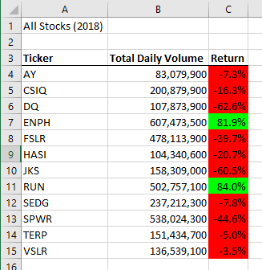

# Moduel 2 Stock Analysis with VBA

## Overview of Project

Steve is helping his parents research the best green energy stocks. He has a dataset of stocks that he wants analyzed, but would like to use the same analysis on new data in the future.  To do this we wrote a macro using VBA to automate the calculations. The original macro needed to be refactored for performance to allow for more data to be analyzed while minimizing the runtime.

### Purpose

The purpose of this project is to refactor the original macro to use less memory and run the analysis more quickly.

## Results

[VBA Challenge Workbook](./VBA_Challenge.xlsm).  

### Stock Performance Between 2017 and 2018
#### 2017 All Stock Analysis

  
#### 2018 All Stock Analysis

### Exectution Time Comparison
Original Macro Execution Time  
 
  
Refactored Macro Execution Time  
 

## Summary

1. What are the advantages or disadvantages of refactoring code?  
During the initial process of writing code, there's much more focus on getting it to work properly. In many cases this means that efficiency and readability take a hit. By refactoring a script that works the coder can make it more efficient by using or reworking loops and shortening conditionals. In doing this the amount of memory used to run the script can be cut down which could also decrease the amount of time it takes to run. Additionally, the coder can pay more attention to readability and commenting. It takes extra time and effort to do this, but in the long run seems worth it.
  
2. How do these pros and cons apply to refactoring the original VBA script?  
In this project, refactoring the code allowed for the same data to be analyzed in a shorter amount of time.
  
